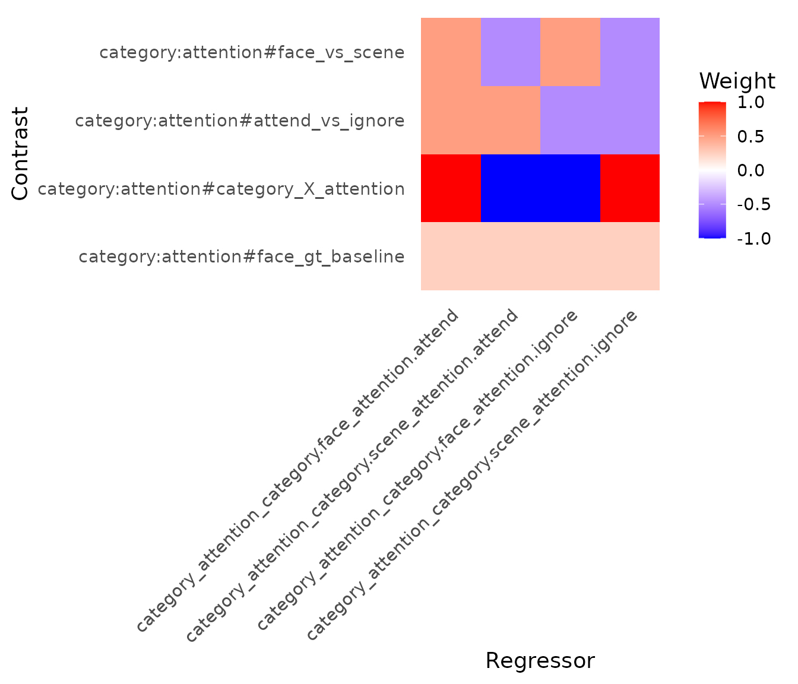

# 

title: “05. Contrasts and Hypothesis Tests” author: “Bradley R.
Buchsbaum” date: “2026-01-28” output: rmarkdown::html_vignette vignette:
\> % % % —

## Introduction to Contrasts

Statistical contrasts are a fundamental component of *f*MRI analyses,
allowing researchers to test specific hypotheses about differences in
brain activity between experimental conditions. The `fmrireg` package
provides a flexible and powerful system for defining, computing, and
applying contrasts to linear models fitted to fMRI data.

This vignette explores the various ways to specify contrasts in
`fmrireg`, from simple pairwise comparisons to more complex interactions
and polynomial trends.

## Example: A 2x2 Factorial Design

To illustrate the contrast functionalities, let’s use a simple
two-by-two factorial design. We have two factors:

1.  **category**: with levels “face” and “scene”
2.  **attention**: with levels “attend” and “ignore”

We’ll assume each unique condition is repeated twice within a single
run.

First, we construct the event table representing this design:

``` r
design <- expand.grid(category = c("face", "scene"), 
                      attention = c("attend", "ignore"), 
                      replication = c(1, 2))
design$onset <- seq(1, 100, length.out = nrow(design)) # Assign arbitrary onsets
design$block <- rep(1, nrow(design))                  # Single block (run)

# Ensure factors are factors
design$category <- factor(design$category)
design$attention <- factor(design$attention)

kable(design, caption = "2x2 Experimental Design Table")
```

| category | attention | replication |     onset | block |
|:---------|:----------|------------:|----------:|------:|
| face     | attend    |           1 |   1.00000 |     1 |
| scene    | attend    |           1 |  15.14286 |     1 |
| face     | ignore    |           1 |  29.28571 |     1 |
| scene    | ignore    |           1 |  43.42857 |     1 |
| face     | attend    |           2 |  57.57143 |     1 |
| scene    | attend    |           2 |  71.71429 |     1 |
| face     | ignore    |           2 |  85.85714 |     1 |
| scene    | ignore    |           2 | 100.00000 |     1 |

2x2 Experimental Design Table

``` r
# Define a sampling frame and create the event model
sframe <- sampling_frame(blocklens = 120, TR = 2)
emodel <- event_model(onset ~ hrf(category, attention), 
                      block = ~block, 
                      data = design, 
                      sampling_frame = sframe)

# Extract the event term for contrast calculation
# In this simple model, there's only one event term
event_term <- terms(emodel)[[1]] 

kable(cells(event_term), caption = "Cells within the 'category:attention' event term")
```

| category | attention |
|:---------|:----------|
| face     | attend    |
| scene    | attend    |
| face     | ignore    |
| scene    | ignore    |

Cells within the ‘category:attention’ event term

This `event_term` object encapsulates the structure of our experimental
conditions and will be used to compute contrast weights.

## Basic Contrasts: `pair_contrast`

The most common type of contrast compares the average activation of one
set of conditions against another. The `pair_contrast` function provides
a convenient way to define such sum-to-zero contrasts.

### Defining Pair Contrasts

`pair_contrast` takes two formulas, `A` and `B`, defining the conditions
to compare, and a mandatory `name`.

Let’s define contrasts for the main effects of *category* (face
vs. scene) and *attention* (attend vs. ignore):

``` r
# Main effect of category: face > scene
con_face_vs_scene <- pair_contrast(~ category == "face", 
                                 ~ category == "scene", 
                                 name = "face_vs_scene")

# Main effect of attention: attend > ignore
con_attend_vs_ignore <- pair_contrast(~ attention == "attend", 
                                    ~ attention == "ignore", 
                                    name = "attend_vs_ignore")
```

### Computing Contrast Weights

Contrast specifications are abstract until applied to a specific model
term structure. The `contrast_weights` function computes the numerical
weights based on the levels within the term.

``` r
wts_face_vs_scene <- contrast_weights(con_face_vs_scene, event_term)
wts_attend_vs_ignore <- contrast_weights(con_attend_vs_ignore, event_term)

cat("Weights for 'face_vs_scene':\n")
```

    ## Weights for 'face_vs_scene':

``` r
kable(wts_face_vs_scene$weights, col.names = wts_face_vs_scene$name)
```

|                                 | face_vs_scene |
|:--------------------------------|--------------:|
| category.face_attention.attend  |           0.5 |
| category.scene_attention.attend |          -0.5 |
| category.face_attention.ignore  |           0.5 |
| category.scene_attention.ignore |          -0.5 |

``` r
cat("\nWeights for 'attend_vs_ignore':\n")
```

    ## 
    ## Weights for 'attend_vs_ignore':

``` r
kable(wts_attend_vs_ignore$weights, col.names = wts_attend_vs_ignore$name)
```

|                                 | attend_vs_ignore |
|:--------------------------------|-----------------:|
| category.face_attention.attend  |              0.5 |
| category.scene_attention.attend |              0.5 |
| category.face_attention.ignore  |             -0.5 |
| category.scene_attention.ignore |             -0.5 |

Notice how `pair_contrast` automatically averages over the levels *not*
mentioned in the formulas. For `face_vs_scene`, it averages over
‘attend’ and ‘ignore’ within each category level before contrasting. The
resulting weights sum to zero (0.25 \* 2 + (-0.25) \* 2 = 0).

## Unit Contrasts: Comparing to Baseline

Sometimes, we want to test whether activation for a condition (or set of
conditions) is significantly different from the implicit baseline (often
represented by the intercept in the model). `unit_contrast` is used for
this purpose. It creates contrasts that sum to 1.

``` r
con_face_vs_baseline <- unit_contrast(~ category == "face", name = "face_gt_baseline")
con_attend_vs_baseline <- unit_contrast(~ attention == "attend", name = "attend_gt_baseline")

wts_face_vs_baseline <- contrast_weights(con_face_vs_baseline, event_term)
wts_attend_vs_baseline <- contrast_weights(con_attend_vs_baseline, event_term)

cat("Weights for 'face_gt_baseline':\n")
```

    ## Weights for 'face_gt_baseline':

``` r
kable(wts_face_vs_baseline$weights, col.names = wts_face_vs_baseline$name)
```

|                                 | face_gt_baseline |
|:--------------------------------|-----------------:|
| category.face_attention.attend  |             0.25 |
| category.scene_attention.attend |             0.25 |
| category.face_attention.ignore  |             0.25 |
| category.scene_attention.ignore |             0.25 |

``` r
cat("\nWeights for 'attend_gt_baseline':\n")
```

    ## 
    ## Weights for 'attend_gt_baseline':

``` r
kable(wts_attend_vs_baseline$weights, col.names = wts_attend_vs_baseline$name)
```

|                                 | attend_gt_baseline |
|:--------------------------------|-------------------:|
| category.face_attention.attend  |               0.25 |
| category.scene_attention.attend |               0.25 |
| category.face_attention.ignore  |               0.25 |
| category.scene_attention.ignore |               0.25 |

These weights average the specified conditions and compare them against
zero (the implicit baseline).

## General Contrasts with `contrast()`

The
[`contrast()`](https://bbuchsbaum.github.io/fmrireg/reference/contrast.md)
function allows for more complex contrasts defined by a single formula
expression. This is useful for interactions or specific linear
combinations of conditions.

Let’s define the interaction contrast: (face:attend - face:ignore) -
(scene:attend - scene:ignore). This tests if the effect of attention
differs between categories.

``` r
# Interaction contrast
con_interaction <- contrast(
  ~ (`face:attend` - `face:ignore`) - (`scene:attend` - `scene:ignore`),
  name = "category_X_attention"
)

wts_interaction <- contrast_weights(con_interaction, event_term)

cat("Weights for 'category_X_attention':\n")
```

    ## Weights for 'category_X_attention':

``` r
kable(wts_interaction$weights, col.names = wts_interaction$name)
```

|                                 | category_X_attention |
|:--------------------------------|---------------------:|
| category.face_attention.attend  |                    1 |
| category.scene_attention.attend |                   -1 |
| category.face_attention.ignore  |                   -1 |
| category.scene_attention.ignore |                    1 |

Note: In the formula for
[`contrast()`](https://bbuchsbaum.github.io/fmrireg/reference/contrast.md),
condition names are formed by joining factor levels with colons (e.g.,
`face:attend`). When condition names contain special characters like
colons, they must be enclosed in backticks. The `contrast_weights`
function evaluates this formula in an environment where each condition
name corresponds to a column vector (1 for that condition, 0 otherwise).

## Contrasts for Main Effects and Interactions

While `pair_contrast` and `contrast` are flexible, `fmrireg` provides
convenience functions for standard ANOVA-like contrasts.

- `oneway_contrast`: Generates contrasts for the main effect of a single
  factor (sum-to-zero coding).
- `interaction_contrast`: Generates contrasts for interaction effects
  between two or more factors.

These often result in multiple contrast columns (F-contrasts) testing
the overall effect.

``` r
# Main effect of category (will produce 1 contrast vector)
con_main_category <- oneway_contrast(~ category, name = "Main_Category")
wts_main_category <- contrast_weights(con_main_category, event_term)

# Interaction effect (will produce 1 contrast vector for a 2x2 design)
con_int_cat_att <- interaction_contrast(~ category * attention, name = "Interaction_CatAtt")
wts_int_cat_att <- contrast_weights(con_int_cat_att, event_term)

cat("Weights for 'Main_Category' (oneway_contrast):\n")
```

    ## Weights for 'Main_Category' (oneway_contrast):

``` r
kable(wts_main_category$weights)
```

|                                 | Main_Category_1 |
|:--------------------------------|----------------:|
| category.face_attention.attend  |              -1 |
| category.scene_attention.attend |               1 |
| category.face_attention.ignore  |              -1 |
| category.scene_attention.ignore |               1 |

``` r
cat("\nWeights for 'Interaction_CatAtt' (interaction_contrast):\n")
```

    ## 
    ## Weights for 'Interaction_CatAtt' (interaction_contrast):

``` r
kable(wts_int_cat_att$weights)
```

|              | Interaction_CatAtt_1 |
|:-------------|---------------------:|
| face_attend  |                    1 |
| scene_attend |                   -1 |
| face_ignore  |                   -1 |
| scene_ignore |                    1 |

Note that the weights generated by
`interaction_contrast(~ category * attention)` match those we manually
specified using
[`contrast()`](https://bbuchsbaum.github.io/fmrireg/reference/contrast.md).
For factors with more levels, these functions would generate multiple
orthogonal contrast columns.

## Polynomial Contrasts for Ordered Factors

If a factor represents ordered levels (e.g., different task difficulty
levels, time points), `poly_contrast` can test for trends (linear,
quadratic, etc.).

Let’s add an ‘intensity’ factor to our design:

``` r
design_poly <- expand.grid(category = c("face", "scene"), 
                           intensity = c(1, 2, 3), # Ordered factor
                           replication = c(1))
design_poly$onset <- seq(1, 60, length.out = nrow(design_poly))
design_poly$block <- rep(1, nrow(design_poly)) 
design_poly$intensity <- factor(design_poly$intensity, ordered = TRUE)

kable(design_poly, caption = "Design with Ordered 'intensity' Factor")
```

| category | intensity | replication | onset | block |
|:---------|:----------|------------:|------:|------:|
| face     | 1         |           1 |   1.0 |     1 |
| scene    | 1         |           1 |  12.8 |     1 |
| face     | 2         |           1 |  24.6 |     1 |
| scene    | 2         |           1 |  36.4 |     1 |
| face     | 3         |           1 |  48.2 |     1 |
| scene    | 3         |           1 |  60.0 |     1 |

Design with Ordered ‘intensity’ Factor

``` r
emodel_poly <- event_model(onset ~ hrf(category, intensity), 
                           block = ~block, 
                           data = design_poly, 
                           sampling_frame = sframe)
event_term_poly <- terms(emodel_poly)[[1]]
```

Now, define a polynomial contrast to test for linear and quadratic
trends of intensity:

``` r
con_poly_intensity <- poly_contrast(~ intensity, degree = 2, name = "Intensity_Trend")
wts_poly_intensity <- contrast_weights(con_poly_intensity, event_term_poly)

cat("Weights for 'Intensity_Trend' (poly_contrast, degree=2):\n")
```

    ## Weights for 'Intensity_Trend' (poly_contrast, degree=2):

``` r
kable(wts_poly_intensity$weights)
```

|                            | Intensity_Trend_1 | Intensity_Trend_2 |
|:---------------------------|------------------:|------------------:|
| category.face_intensity.1  |              -0.5 |         0.2886751 |
| category.scene_intensity.1 |              -0.5 |         0.2886751 |
| category.face_intensity.2  |               0.0 |        -0.5773503 |
| category.scene_intensity.2 |               0.0 |        -0.5773503 |
| category.face_intensity.3  |               0.5 |         0.2886751 |
| category.scene_intensity.3 |               0.5 |         0.2886751 |

The output has two columns: `poly1` for the linear trend and `poly2` for
the quadratic trend.

## Helper Functions for Common Comparisons

Two helpers simplify common multi-level comparisons:

- `pair_contrast`: Creates a pairwise comparison between two levels of a
  factor.
- `one_against_all_contrast`: Compares each level against the average of
  all other levels.

``` r
# Pairwise contrast for category using pair_contrast
con_pairwise_cat <- pair_contrast(~ category == "face", 
                                 ~ category == "scene", 
                                 name = "cat_face_scene")

# Compare each attention level vs the other
con_one_all_att <- one_against_all_contrast(levels(design$attention), facname = "attention")

# Since con_one_all_att is already a contrast_set, we need to extract its elements
# and combine them properly with the single contrast
all_helper_contrasts <- list(con_pairwise_cat)
all_helper_contrasts <- append(all_helper_contrasts, con_one_all_att)
con_set_helpers <- do.call(contrast_set, all_helper_contrasts)

# Calculate weights (demonstrating contrast_set)
wts_helpers <- contrast_weights(con_set_helpers, event_term)

# Display weights for one_against_all
cat("Weights for 'con_attend_vs_other':\n")
```

    ## Weights for 'con_attend_vs_other':

``` r
kable(wts_helpers$con_attend_vs_other$weights)
```

|                                 | con_attend_vs_other |
|:--------------------------------|--------------------:|
| category.face_attention.attend  |                 0.5 |
| category.scene_attention.attend |                 0.5 |
| category.face_attention.ignore  |                -0.5 |
| category.scene_attention.ignore |                -0.5 |

``` r
cat("\nWeights for 'con_ignore_vs_other':\n")
```

    ## 
    ## Weights for 'con_ignore_vs_other':

``` r
kable(wts_helpers$con_ignore_vs_other$weights)
```

|                                 | con_ignore_vs_other |
|:--------------------------------|--------------------:|
| category.face_attention.attend  |                -0.5 |
| category.scene_attention.attend |                -0.5 |
| category.face_attention.ignore  |                 0.5 |
| category.scene_attention.ignore |                 0.5 |

## Grouping Contrasts: `contrast_set`

You can group multiple contrast specifications using `contrast_set`.
When `contrast_weights` is called on a `contrast_set`, it returns a
named list of computed contrast weight objects.

``` r
# Combine several previously defined contrasts
all_contrasts <- contrast_set(
  con_face_vs_scene,
  con_attend_vs_ignore,
  con_interaction,
  con_face_vs_baseline
)

print(all_contrasts)
```

    ## 
    ## === Contrast Set ===
    ## 
    ##  Overview:
    ##   * Number of contrasts: 4 
    ##   * Types of contrasts:
    ##     - contrast_formula_spec : 1 
    ##     - pair_contrast_spec : 2 
    ##     - unit_contrast_spec : 1 
    ## 
    ##   Individual Contrasts:
    ## 
    ## [1] face_vs_scene (pair_contrast_spec)
    ##     Formula: ~category == "face" vs  ~category == "scene"
    ## 
    ## [2] attend_vs_ignore (pair_contrast_spec)
    ##     Formula: ~attention == "attend" vs  ~attention == "ignore"
    ## 
    ## [3] category_X_attention (contrast_formula_spec)
    ##     Formula: ~(`face:attend` - `face:ignore`) - (`scene:attend` - `scene:ignore`)
    ## 
    ## [4] face_gt_baseline (unit_contrast_spec)
    ##     Formula: ~category == "face"

``` r
# Compute weights for the entire set
all_weights <- contrast_weights(all_contrasts, event_term)

# Access weights for a specific contrast within the set
cat("\nAccessing weights for 'face_vs_scene' from the set:\n")
```

    ## 
    ## Accessing weights for 'face_vs_scene' from the set:

``` r
kable(all_weights$face_vs_scene$weights)
```

|                                 | face_vs_scene |
|:--------------------------------|--------------:|
| category.face_attention.attend  |           0.5 |
| category.scene_attention.attend |          -0.5 |
| category.face_attention.ignore  |           0.5 |
| category.scene_attention.ignore |          -0.5 |

## Applying Contrasts in `fmri_lm`

Contrasts are typically specified within the
[`hrf()`](https://bbuchsbaum.github.io/fmridesign/reference/hrf.html)
function in the `fmri_lm` formula. You can provide a single contrast
specification or a `contrast_set`.

``` r
# Simulate some simple data for demonstration
ysim <- matrix(rnorm(120 * 3), 120, 3) # 3 voxels
dataset_sim <- matrix_dataset(ysim, TR = 2, run_length = 120, event_table = design)

# Fit model with the contrast set defined earlier
fmri_fit <- fmri_lm(
  formula = onset ~ hrf(category, attention, contrasts = all_contrasts),
  block = ~ block,
  dataset = dataset_sim,
  strategy = "chunkwise" # Use chunkwise for matrix_dataset
)

# Print summary of the fitted model (shows contrasts)
print(fmri_fit)
```

*(Note: The above fitting code is set to `eval=FALSE` to avoid lengthy
computation in the vignette build, but demonstrates the principle.)*

## Extracting Contrast Results

After fitting a model with contrasts, you can extract the results using
standard accessor functions, specifying `type = "contrasts"` or
`type = "F"`:

- `coef(fmri_fit, type = "contrasts")`: Estimated contrast values.
- `stats(fmri_fit, type = "contrasts")`: t-statistics for contrasts.
- `standard_error(fmri_fit, type = "contrasts")`: Standard errors for
  contrasts.
- `stats(fmri_fit, type = "F")`: F-statistics (if F-contrasts were
  defined, e.g., via `oneway_contrast`).

``` r
# Extract estimated contrast values
contrast_estimates <- coef(fmri_fit, type = "contrasts")
kable(contrast_estimates, caption = "Estimated Contrast Values")

# Extract t-statistics
contrast_tstats <- stats(fmri_fit, type = "contrasts")
kable(contrast_tstats, caption = "Contrast t-statistics")

# Extract standard errors
contrast_se <- standard_error(fmri_fit, type = "contrasts")
kable(contrast_se, caption = "Contrast Standard Errors")
```

## Visualizing Contrast Weights

The `plot_contrasts` function provides a heatmap visualization of the
contrast weights applied across all regressors in the design matrix
(including baseline terms if present).

``` r
# We need to add contrasts *directly* to the event model for plotting
emodel_with_cons <- event_model(
  onset ~ hrf(category, attention, contrasts = all_contrasts),
  block = ~ block, 
  data = design, 
  sampling_frame = sframe
)

# Plot the contrasts (using default baseline model)
tryCatch({
  plot_contrasts(emodel_with_cons, rotate_x_text = TRUE, coord_fixed = FALSE)
}, error = function(e) {
  cat("Note: plot_contrasts() encountered an issue and was skipped.\n")
  cat("Error:", e$message, "\n")
})
```

 This
plot helps verify that contrasts are specified correctly relative to the
full model design matrix.

## Working with Contrast Weights

The computed contrast weights can be used directly in statistical
analyses or exported to other analysis packages. The weights matrix
shows exactly how each experimental condition contributes to the
contrast:

``` r
# View the structure of interaction contrast weights
cat("Interaction contrast structure:\n")
```

    ## Interaction contrast structure:

``` r
str(wts_interaction)
```

    ## List of 5
    ##  $ term         :List of 9
    ##   ..$ varname         : chr "category:attention"
    ##   ..$ events          :List of 2
    ##   .. ..$ category :List of 7
    ##   .. .. ..$ varname   : chr "category"
    ##   .. .. .. ..- attr(*, "orig_names")= chr "category"
    ##   .. .. ..$ onsets    : num [1:8] 1 15.1 29.3 43.4 57.6 ...
    ##   .. .. ..$ durations : num [1:8] 0 0 0 0 0 0 0 0
    ##   .. .. ..$ blockids  : int [1:8] 1 1 1 1 1 1 1 1
    ##   .. .. ..$ value     : int [1:8, 1] 1 2 1 2 1 2 1 2
    ##   .. .. .. ..- attr(*, "dimnames")=List of 2
    ##   .. .. .. .. ..$ : NULL
    ##   .. .. .. .. ..$ : chr "category"
    ##   .. .. .. .. .. ..- attr(*, "orig_names")= chr "category"
    ##   .. .. ..$ continuous: logi FALSE
    ##   .. .. ..$ meta      :List of 1
    ##   .. .. .. ..$ levels: chr [1:2] "face" "scene"
    ##   .. .. ..- attr(*, "class")= chr [1:2] "event" "event_seq"
    ##   .. ..$ attention:List of 7
    ##   .. .. ..$ varname   : chr "attention"
    ##   .. .. .. ..- attr(*, "orig_names")= chr "attention"
    ##   .. .. ..$ onsets    : num [1:8] 1 15.1 29.3 43.4 57.6 ...
    ##   .. .. ..$ durations : num [1:8] 0 0 0 0 0 0 0 0
    ##   .. .. ..$ blockids  : int [1:8] 1 1 1 1 1 1 1 1
    ##   .. .. ..$ value     : int [1:8, 1] 1 1 2 2 1 1 2 2
    ##   .. .. .. ..- attr(*, "dimnames")=List of 2
    ##   .. .. .. .. ..$ : NULL
    ##   .. .. .. .. ..$ : chr "attention"
    ##   .. .. .. .. .. ..- attr(*, "orig_names")= chr "attention"
    ##   .. .. ..$ continuous: logi FALSE
    ##   .. .. ..$ meta      :List of 1
    ##   .. .. .. ..$ levels: chr [1:2] "attend" "ignore"
    ##   .. .. ..- attr(*, "class")= chr [1:2] "event" "event_seq"
    ##   ..$ subset          : logi [1:8] TRUE TRUE TRUE TRUE TRUE TRUE ...
    ##   ..$ event_table     : tibble [8 × 2] (S3: tbl_df/tbl/data.frame)
    ##   .. ..$ category : Factor w/ 2 levels "face","scene": 1 2 1 2 1 2 1 2
    ##   .. ..$ attention: Factor w/ 2 levels "attend","ignore": 1 1 2 2 1 1 2 2
    ##   ..$ onsets          : num [1:8] 1 15.1 29.3 43.4 57.6 ...
    ##   ..$ blockids        : int [1:8] 1 1 1 1 1 1 1 1
    ##   ..$ durations       : num [1:8] 0 0 0 0 0 0 0 0
    ##   ..$ condition_levels: chr [1:4] "category.face_attention.attend" "category.scene_attention.attend" "category.face_attention.ignore" "category.scene_attention.ignore"
    ##   ..$ condition_ids   : int [1:8] 1 2 3 4 1 2 3 4
    ##   ..- attr(*, "class")= chr [1:2] "event_term" "event_seq"
    ##   ..- attr(*, "hrfspec")=List of 16
    ##   .. ..$ name     : chr "category:attention"
    ##   .. ..$ label    : chr "hrf(category,attention)"
    ##   .. ..$ id       : NULL
    ##   .. ..$ vars     :List of 2
    ##   .. .. ..$ : language ~category
    ##   .. .. .. ..- attr(*, ".Environment")=<environment: 0x5610265589b8> 
    ##   .. .. ..$ : language ~attention
    ##   .. .. .. ..- attr(*, ".Environment")=<environment: 0x5610265589b8> 
    ##   .. .. ..- attr(*, "class")= chr [1:2] "quosures" "list"
    ##   .. ..$ varnames : Named chr [1:2] "category" "attention"
    ##   .. .. ..- attr(*, "names")= chr [1:2] "" ""
    ##   .. ..$ hrf      :function (t)  
    ##   .. .. ..- attr(*, "class")= chr [1:2] "HRF" "function"
    ##   .. .. ..- attr(*, "name")= chr "SPMG1"
    ##   .. .. ..- attr(*, "nbasis")= int 1
    ##   .. .. ..- attr(*, "span")= num 24
    ##   .. .. ..- attr(*, "param_names")= chr [1:3] "P1" "P2" "A1"
    ##   .. .. ..- attr(*, "params")=List of 3
    ##   .. .. .. ..$ P1: num 5
    ##   .. .. .. ..$ P2: num 15
    ##   .. .. .. ..$ A1: num 0.0833
    ##   .. ..$ hrf_fun  : NULL
    ##   .. ..$ onsets   : NULL
    ##   .. ..$ durations: NULL
    ##   .. ..$ prefix   : NULL
    ##   .. ..$ subset   : NULL
    ##   .. ..$ precision: num 0.3
    ##   .. ..$ contrasts: NULL
    ##   .. ..$ summate  : logi TRUE
    ##   .. ..$ uid      : chr "t01"
    ##   .. ..$ term_tag : chr "category_attention"
    ##   .. ..- attr(*, "class")= chr [1:2] "hrfspec" "list"
    ##   ..- attr(*, "term_tag")= chr "category_attention"
    ##   ..- attr(*, "uid")= chr "t01"
    ##  $ name         : chr "category_X_attention"
    ##  $ weights      : num [1:4, 1] 1 -1 -1 1
    ##   ..- attr(*, "dimnames")=List of 2
    ##   .. ..$ : chr [1:4] "category.face_attention.attend" "category.scene_attention.attend" "category.face_attention.ignore" "category.scene_attention.ignore"
    ##   .. ..$ : NULL
    ##  $ condnames    : chr [1:4] "category.face_attention.attend" "category.scene_attention.attend" "category.face_attention.ignore" "category.scene_attention.ignore"
    ##  $ contrast_spec:List of 4
    ##   ..$ A    :Class 'formula'  language ~(`face:attend` - `face:ignore`) - (`scene:attend` - `scene:ignore`)
    ##   .. .. ..- attr(*, ".Environment")=<environment: R_GlobalEnv> 
    ##   ..$ B    : NULL
    ##   ..$ where: NULL
    ##   ..$ name : chr "category_X_attention"
    ##   ..- attr(*, "class")= chr [1:3] "contrast_formula_spec" "contrast_spec" "list"
    ##  - attr(*, "class")= chr [1:2] "contrast" "list"

``` r
cat("\nContrast weights matrix:\n")
```

    ## 
    ## Contrast weights matrix:

``` r
print(wts_interaction$conmat)
```

    ## NULL

## Next

- [Benchmark
  Datasets](https://bbuchsbaum.github.io/articles/benchmark_datasets.md)
- [Group
  Analysis](https://bbuchsbaum.github.io/articles/group_analysis.md)

## Conclusion

The `fmrireg` package offers a comprehensive system for defining and
applying statistical contrasts in fMRI analysis. From simple pairwise
comparisons (`pair_contrast`) and baseline tests (`unit_contrast`) to
complex formula-based definitions (`contrast`), trend analysis
(`poly_contrast`), and ANOVA-style effects (`oneway_contrast`,
`interaction_contrast`), researchers have fine-grained control over
hypothesis testing. The integration with `fmri_lm` and visualization
tools like `plot_contrasts` facilitates robust and interpretable fMRI
modeling.
