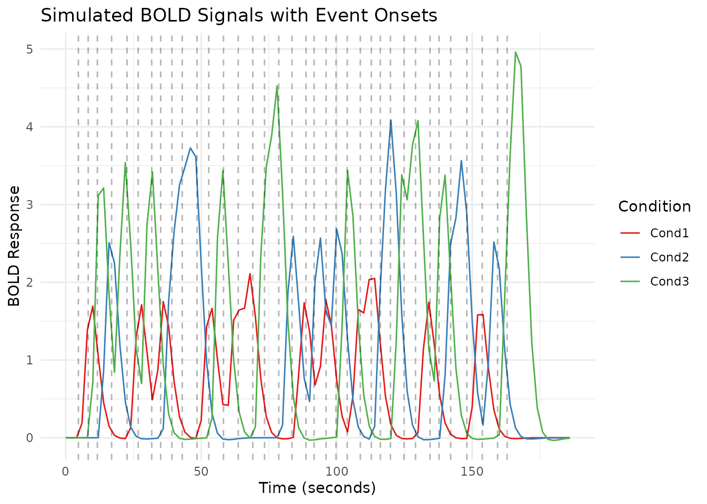

# 

title: “03. Simulating fMRI Data” author: “Bradley R. Buchsbaum” date:
“2026-01-28” output: rmarkdown::html_vignette vignette: \> % % % —

## Introduction to fMRI Data Simulation

Simulation is an essential tool for fMRI method development, validation,
and teaching. The `fmrireg` package offers several functions to simulate
fMRI data with varying levels of complexity:

1.  **`simulate_bold_signal`**: Simulates clean BOLD responses for
    multiple experimental conditions
2.  **`simulate_noise_vector`**: Generates realistic fMRI noise with
    temporal autocorrelation, drift, and physiological components
3.  **`simulate_simple_dataset`**: Combines signal and noise for a
    complete dataset based on SNR
4.  **`simulate_fmri_matrix`**: Creates multiple time series with shared
    event timing but column-specific variation in parameters

This vignette demonstrates how to use these functions to create
realistic fMRI simulations for various purposes.

## Next

- 04 fMRI Linear Model (GLM) \## Simulating Clean BOLD Signals

Let’s start with `simulate_bold_signal`, which generates a clean
hemodynamic response signal for multiple experimental conditions.

``` r
# Simulate 3 conditions with different amplitudes
sim <- simulate_bold_signal(ncond = 3, amps = c(1.0, 1.5, 2.0), TR = 2)

# Extract the data and plot
time <- sim$mat[,1]  # First column contains time
signals <- sim$mat[,-1]  # Other columns contain condition signals

# Create a tidy dataframe for plotting
df <- data.frame(
  Time = time,
  Cond1 = signals[,1],
  Cond2 = signals[,2],
  Cond3 = signals[,3]
)

df_long <- tidyr::pivot_longer(df, cols = c(Cond1, Cond2, Cond3), 
                        names_to = "Condition", 
                        values_to = "Response")

# Plot using ggplot2
ggplot(df_long, aes(x = Time, y = Response, color = Condition)) +
  geom_line() +
  theme_minimal() +
  labs(title = "Simulated BOLD Signals for Three Conditions",
       x = "Time (seconds)",
       y = "BOLD Response",
       color = "Condition") +
  scale_color_brewer(palette = "Set1")
```


``` r
# Mark trial onsets on the time axis
ggplot(df_long, aes(x = Time, y = Response, color = Condition)) +
  geom_line() +
  geom_vline(xintercept = sim$onset, linetype = "dashed", alpha = 0.3) +
  theme_minimal() +
  labs(title = "Simulated BOLD Signals with Event Onsets",
       x = "Time (seconds)",
       y = "BOLD Response",
       color = "Condition") +
  scale_color_brewer(palette = "Set1")
```



The function returns a list containing: - **`onset`**: Event onset
times - **`condition`**: Condition labels for each event - **`mat`**:
Matrix with time points and BOLD responses for each condition

You can control: - Number of conditions (`ncond`) - Number of
repetitions per condition (`nreps`) - HRF shape (`hrf`) - Amplitudes for
each condition (`amps`) - Inter-stimulus interval range (`isi`) -
Amplitude variability (`ampsd`)

## Simulating Realistic fMRI Noise

The `simulate_noise_vector` function generates realistic fMRI noise by
combining various noise sources common in real fMRI data. To understand
its components, let’s simulate and visualize them separately and
combined.

``` r
# Simulation parameters
n_timepoints <- 200
TR <- 2
time <- seq(0, (n_timepoints - 1) * TR, by = TR)

# Create noise components with clear differences
set.seed(123) # For reproducibility

# 1. Simulate Pure White Noise
noise_white <- simulate_noise_vector(n_timepoints, TR = TR, 
                                  ar = 0, ma = 0,
                                  drift_amplitude = 0, physio = FALSE, sd = 1)
```

    ## Warning in min(Mod(polyroot(c(1, -model$ar)))): no non-missing arguments to
    ## min; returning Inf

``` r
# 2. Simulate ARMA Noise (without drift/physio)
noise_arma <- simulate_noise_vector(n_timepoints, TR = TR, 
                                 ar = c(0.6), ma = c(0.3), 
                                 drift_amplitude = 0, physio = FALSE, sd = 1)

# 3. Generate Drift Component Directly
drift_freq <- 1/128
drift_amplitude <- 2
noise_drift <- drift_amplitude * sin(2 * pi * drift_freq * time)

# 4. Generate Physiological Noise Component Directly
# Make physiological components more prominent
noise_cardiac <- 1.5 * sin(2 * pi * 0.3 * time)  # Respiratory (~0.3 Hz)
noise_respiratory <- 1.0 * sin(2 * pi * 0.8 * time)  # Cardiac-like (~0.8 Hz, observable with TR=2s)
noise_physio <- noise_cardiac + noise_respiratory

# 5. Simulate Combined Noise (ARMA + Drift + Physio)
noise_combined <- noise_arma + noise_drift + noise_physio

# Combine into a data frame for plotting time courses
noise_df <- data.frame(
  Time = time,
  White_Noise = noise_white,
  ARMA_Noise = noise_arma,
  Drift_Component = noise_drift,
  Physiological_Noise = noise_physio,
  Combined_Noise = noise_combined
)

# Create long format dataframe for plotting without pipes
noise_long <- tidyr::pivot_longer(noise_df, 
                                  cols = -Time,
                                  names_to = "NoiseType", 
                                  values_to = "Signal")

# Set factor levels for proper ordering
noise_long$NoiseType <- factor(noise_long$NoiseType, 
                              levels = c("White_Noise", "ARMA_Noise", 
                                        "Drift_Component", "Physiological_Noise", 
                                        "Combined_Noise"),
                              labels = c("White Noise", "ARMA Noise", 
                                        "Drift Component", "Physiological Noise", 
                                        "Combined Noise"))

# Plot Time Courses (Faceted)
ggplot(noise_long, aes(x = Time, y = Signal, color = NoiseType)) +
  geom_line() +
  facet_wrap(~NoiseType, ncol = 1, scales = "free_y") + # Use free_y scales
  theme_minimal() +
  theme(legend.position = "none") + # Remove legend as facets show type
  labs(title = "Simulated fMRI Noise Components: Time Courses",
       x = "Time (seconds)",
       y = "Signal Amplitude")
```


``` r
# --- Power Spectrum Analysis ---
library(stats)

calculate_spectrum <- function(signal, TR) {
  # Detrend
  signal <- signal - mean(signal)
  
  # Calculate FFT
  n <- length(signal)
  # Get proper periodogram-based power spectrum
  fft_result <- fft(signal)
  # Get power - divide by n to normalize
  power <- Mod(fft_result)^2 / n
  
  # Get positive frequencies only (up to Nyquist)
  nyquist_index <- floor(n/2) + 1
  freq <- seq(0, 1/(2*TR), length.out = nyquist_index)
  power_pos <- power[1:nyquist_index]
  
  # For one-sided spectrum, multiply by 2 (except DC and Nyquist)
  if (n > 1) {
    power_pos[2:(length(power_pos)-ifelse(n %% 2 == 0, 1, 0))] <- 
      2 * power_pos[2:(length(power_pos)-ifelse(n %% 2 == 0, 1, 0))]
  }
  
  # Return as data frame
  data.frame(Frequency = freq, Power = power_pos)
}

# Calculate spectra
spec_white <- calculate_spectrum(noise_white, TR)
spec_arma <- calculate_spectrum(noise_arma, TR)
spec_drift <- calculate_spectrum(noise_drift, TR)
spec_physio <- calculate_spectrum(noise_physio, TR)
spec_combined <- calculate_spectrum(noise_combined, TR)

# Add noise type column to each data frame
spec_white$NoiseType <- "White Noise"
spec_arma$NoiseType <- "ARMA Noise"
spec_drift$NoiseType <- "Drift Component"
spec_physio$NoiseType <- "Physiological Noise"
spec_combined$NoiseType <- "Combined Noise"

# Combine all spectra into one data frame
spec_df <- rbind(spec_white, spec_arma, spec_drift, spec_physio, spec_combined)

# Set factor levels for proper ordering
spec_df$NoiseType <- factor(spec_df$NoiseType, 
                           levels = c("White Noise", "ARMA Noise", 
                                     "Drift Component", "Physiological Noise", 
                                     "Combined Noise"))

# Create better drift visualization
# First, generate a longer drift signal to better resolve low frequencies
n_long <- 1024
time_long <- seq(0, (n_long - 1) * TR, by = TR)
drift_long <- drift_amplitude * sin(2 * pi * drift_freq * time_long)
spec_drift_long <- calculate_spectrum(drift_long, TR)
spec_drift_long$NoiseType <- "Drift Component (High Resolution)"

# Plot Power Spectra in regular scale to show true spectral shape
ggplot() +
  # Regular components
  geom_line(data = spec_df, aes(x = Frequency, y = Power, color = NoiseType)) +
  # Add high-resolution drift component
  geom_line(data = subset(spec_drift_long, Frequency <= 0.05), 
           aes(x = Frequency, y = Power), color = "darkgreen", linetype = "dashed") +
  theme_minimal() +
  facet_wrap(~NoiseType, ncol = 1, scales = "free_y") +
  theme(legend.position = "none") +
  labs(title = "Power Spectra of Different Noise Components",
       x = "Frequency (Hz)",
       y = "Power") +
  scale_color_brewer(palette = "Set1") +
  coord_cartesian(xlim = c(0, 0.25))  # Limit to Nyquist frequency
```


``` r
# Also plot with log scale to show all components together
ggplot(spec_df, aes(x = Frequency, y = Power, color = NoiseType)) +
  geom_line() +
  theme_minimal() +
  labs(title = "Power Spectra of Different Noise Components (Log Scale)",
       x = "Frequency (Hz)",
       y = "Power (log scale)") +
  scale_y_log10() +  # Log scale to see all components
  scale_color_brewer(palette = "Set1") +
  theme(legend.position = "top") +
  coord_cartesian(xlim = c(0, 0.25))  # Limit to Nyquist frequency
```


``` r
# Special zoom-in plot to focus on drift component
drift_freq_idx <- which.min(abs(spec_df$Frequency - drift_freq))
ggplot() +
  geom_line(data = subset(spec_df, NoiseType == "Drift Component"), 
           aes(x = Frequency, y = Power), color = "darkgreen") +
  geom_line(data = subset(spec_drift_long, Frequency <= 0.05), 
           aes(x = Frequency, y = Power), color = "darkgreen", linetype = "dashed") +
  geom_vline(xintercept = drift_freq, linetype = "dotted", color = "red") +
  theme_minimal() +
  labs(title = "Zoomed Power Spectrum of Drift Component",
       subtitle = paste("Expected peak at", drift_freq, "Hz"),
       x = "Frequency (Hz)",
       y = "Power") +
  coord_cartesian(xlim = c(0, 0.05))  # Zoom in on low frequencies
```


The simulation shows five distinct types of noise components:

1.  **White Noise**: Random fluctuations with equal power across all
    frequencies (flat power spectrum).

2.  **ARMA Noise**: Temporally autocorrelated noise with a
    characteristic “smoothed” appearance. The power spectrum shows more
    power at lower frequencies.

3.  **Drift Component**: A very slow oscillation typical of scanner
    drift or physiological trends. The power spectrum shows a dominant
    peak at a very low frequency.

4.  **Physiological Noise**: Regular oscillations at frequencies
    corresponding to respiration (~0.3 Hz) and cardiac-like activity
    (~0.8 Hz). In real fMRI data with TR=2s, cardiac frequencies (~1.2
    Hz) would be aliased.

5.  **Combined Noise**: All components together, creating a complex
    noise structure typical of real fMRI data. The power spectrum shows
    features from all contributing components.

These components, when added to task-related signals, create realistic
fMRI time series.

## Creating a Complete Dataset with Signal and Noise

The `simulate_simple_dataset` function combines clean signals and noise
to create a complete fMRI dataset with a specified signal-to-noise ratio
(SNR).

``` r
# Set seed for reproducibility
set.seed(42)

# Simulate a dataset with 3 conditions and different SNR levels
data_snr_1.0 <- simulate_simple_dataset(ncond = 3, TR = 2, snr = 1.0)
data_snr_0.5 <- simulate_simple_dataset(ncond = 3, TR = 2, snr = 0.5)
data_snr_0.2 <- simulate_simple_dataset(ncond = 3, TR = 2, snr = 0.2)

# Improved function to create data frame for plotting
create_plot_df <- function(data, snr_label) {
  time <- data$clean$mat[,1]
  
  # Extract clean signals and noisy signals 
  # Instead of averaging, use the condition with the clearest signal pattern
  # Usually the middle column has the most distinct pattern
  best_column <- which.max(apply(data$clean$mat[,-1], 2, function(x) max(x) - min(x)))
  clean_signal <- data$clean$mat[, best_column + 1]  # +1 because column 1 is time
  noisy_signal <- data$noisy[, best_column + 1]      # Corresponding noisy signal
  
  df <- data.frame(
    Time = time,
    Clean = clean_signal,
    Noisy = noisy_signal,
    SNR = snr_label
  )
  
  return(df)
}

# Combine data for different SNR values
plot_df <- rbind(
  create_plot_df(data_snr_1.0, "SNR = 1.0"),
  create_plot_df(data_snr_0.5, "SNR = 0.5"),
  create_plot_df(data_snr_0.2, "SNR = 0.2")
)

# Convert to long format
plot_df_long <- tidyr::pivot_longer(plot_df, 
                                    cols = -c(Time, SNR),
                                    names_to = "Type", 
                                    values_to = "Signal")

# First approach: Overlay clean and noisy signals
ggplot(plot_df_long, aes(x = Time, y = Signal, color = Type)) +
  geom_line() +
  facet_wrap(~SNR, ncol = 1) +
  theme_minimal() +
  labs(title = "Clean vs. Noisy Signals at Different SNR Levels",
       subtitle = "Single condition shown for clarity",
       x = "Time (seconds)",
       y = "Signal",
       color = "Signal Type") +
  scale_color_manual(values = c("Clean" = "darkred", "Noisy" = "steelblue")) +
  theme(legend.position = "top")
```


``` r
# Second approach: Plot signal+noise and then just signal below it
# Create custom panel plots for each SNR
plot_faceted <- function(df, snr_value) {
  df_subset <- subset(df, SNR == snr_value)
  
  # Calculate the noise component
  noise <- df_subset$Noisy - df_subset$Clean
  
  # Create a data frame for the decomposition plot
  decomp_df <- data.frame(
    Time = rep(df_subset$Time, 3),
    Component = factor(rep(c("Signal+Noise", "Signal", "Noise"), each = length(df_subset$Time)),
                      levels = c("Signal+Noise", "Signal", "Noise")),
    Value = c(df_subset$Noisy, df_subset$Clean, noise)
  )
  
  # Plot with custom y-axis ranges
  ggplot(decomp_df, aes(x = Time, y = Value, color = Component)) +
    geom_line() +
    facet_wrap(~Component, ncol = 1, scales = "free_y") +
    theme_minimal() +
    labs(title = paste("Signal Decomposition at", snr_value),
         x = "Time (seconds)",
         y = "Amplitude") +
    scale_color_manual(values = c("Signal+Noise" = "steelblue", 
                                 "Signal" = "darkred", 
                                 "Noise" = "darkgreen")) +
    theme(legend.position = "none")
}

# Create each SNR plot
p1 <- plot_faceted(plot_df, "SNR = 1.0")
p2 <- plot_faceted(plot_df, "SNR = 0.5")
p3 <- plot_faceted(plot_df, "SNR = 0.2")

# Display plots in sequence
p1
```


``` r
p2
```


``` r
p3
```


``` r
# Calculate statistics (using standard R to avoid pipe operator issues)
snr_stats_list <- list()
for (snr_val in unique(plot_df_long$SNR)) {
  for (type_val in unique(plot_df_long$Type)) {
    subset_data <- plot_df_long[plot_df_long$SNR == snr_val & plot_df_long$Type == type_val, ]
    snr_stats_list[[length(snr_stats_list) + 1]] <- data.frame(
      SNR = snr_val,
      Type = type_val,
      Mean = mean(subset_data$Signal),
      SD = sd(subset_data$Signal),
      Range = max(subset_data$Signal) - min(subset_data$Signal)
    )
  }
}
snr_stats <- do.call(rbind, snr_stats_list)

# Print the statistics
knitr::kable(snr_stats, caption = "Statistics of clean and noisy signals at different SNR levels")
```

| SNR       | Type  |      Mean |        SD |     Range |
|:----------|:------|----------:|----------:|----------:|
| SNR = 1.0 | Clean | 0.6484660 | 0.9154157 |  3.005768 |
| SNR = 1.0 | Noisy | 1.0555953 | 1.5153738 |  8.541682 |
| SNR = 0.5 | Clean | 0.6082536 | 0.7916189 |  2.760946 |
| SNR = 0.5 | Noisy | 0.7358011 | 2.4147113 | 13.835178 |
| SNR = 0.2 | Clean | 0.6342752 | 0.8631817 |  2.804079 |
| SNR = 0.2 | Noisy | 1.2170041 | 5.2307652 | 25.249274 |

Statistics of clean and noisy signals at different SNR levels

This visualization shows how different SNR levels affect the fMRI time
series. The lower the SNR, the more the noise dominates the signal. For
each SNR level, we show:

1.  **The original clean signal** (red line): The true underlying BOLD
    response
2.  **The noisy signal** (blue line): What would actually be measured by
    the scanner
3.  **Signal decomposition**: Visualization of how the signal, noise,
    and combined signal relate at each SNR level

With SNR = 1.0, the signal pattern remains clearly visible despite the
noise. At SNR = 0.5, some features of the signal are obscured, while at
SNR = 0.2, the noise substantially masks the underlying signal, making
accurate detection more challenging without proper statistical methods.

The function returns: - **`clean`**: The simulated signals without
noise - **`noisy`**: The signals with added noise - **`noise`**: The
simulated noise component - **`onsets`**: Trial onset times -
**`conditions`**: Condition labels for each trial

## Simulating Matrix Time Series with Column-Specific Variation

The most advanced simulation function, `simulate_fmri_matrix`, generates
multiple time series (columns) that share the same event timing but have
column-specific variations in amplitudes and durations. This is
particularly useful for simulating multiple voxels or regions with
related but slightly different response profiles.

``` r
# Simulate 5 voxels (columns) with shared event timing
# but variation in amplitudes and durations
sim_matrix <- simulate_fmri_matrix(
  n = 5,                  # 5 voxels/regions
  total_time = 200,       # 200 seconds of scan time
  TR = 2,                 # TR = 2 seconds
  n_events = 10,          # 10 events
  amplitudes = 1,         # Base amplitude = 1
  amplitude_sd = 0.3,     # Amplitude variability
  durations = 2,          # Base duration = 2 seconds
  duration_sd = 0.5,      # Duration variability
  noise_type = "ar1",     # AR(1) noise
  noise_sd = 0.5          # Noise standard deviation
)

# Extract the time series data
ts_data <- sim_matrix$time_series
matrix_data <- ts_data$datamat

# Create a tidy data frame for plotting
time_points <- seq(0, by = 2, length.out = nrow(matrix_data))
plot_data <- data.frame(Time = time_points)

for(i in 1:ncol(matrix_data)) {
  plot_data[[paste0("Voxel", i)]] <- matrix_data[, i]
}

plot_data_long <- tidyr::pivot_longer(
  plot_data, 
  cols = starts_with("Voxel"), 
  names_to = "Voxel", 
  values_to = "Signal"
)

# Plot all time series
ggplot(plot_data_long, aes(x = Time, y = Signal, color = Voxel)) +
  geom_line(alpha = 0.8) +
  theme_minimal() +
  labs(title = "Multiple Simulated Time Series with Column-Specific Variation",
       x = "Time (seconds)",
       y = "Signal",
       color = "Voxel") +
  scale_color_brewer(palette = "Set2")
```


``` r
# Plot the amplitude and duration matrices to visualize trial-by-trial variations
amp_df <- as.data.frame(sim_matrix$ampmat)
colnames(amp_df) <- paste0("Voxel", 1:ncol(amp_df))
amp_df$Event <- 1:nrow(amp_df)

dur_df <- as.data.frame(sim_matrix$durmat)
colnames(dur_df) <- paste0("Voxel", 1:ncol(dur_df))
dur_df$Event <- 1:nrow(dur_df)

# Transform to long format
amp_long <- tidyr::pivot_longer(
  amp_df, 
  cols = starts_with("Voxel"), 
  names_to = "Voxel", 
  values_to = "Amplitude"
)

dur_long <- tidyr::pivot_longer(
  dur_df, 
  cols = starts_with("Voxel"), 
  names_to = "Voxel", 
  values_to = "Duration"
)

# Plot amplitude variation across voxels
ggplot(amp_long, aes(x = Event, y = Amplitude, color = Voxel, group = Voxel)) +
  geom_line() +
  geom_point() +
  theme_minimal() +
  labs(title = "Amplitude Variation Across Events and Voxels",
       x = "Event Number",
       y = "Amplitude",
       color = "Voxel") +
  scale_color_brewer(palette = "Set2")
```


``` r
# Plot duration variation across voxels
ggplot(dur_long, aes(x = Event, y = Duration, color = Voxel, group = Voxel)) +
  geom_line() +
  geom_point() +
  theme_minimal() +
  labs(title = "Duration Variation Across Events and Voxels",
       x = "Event Number",
       y = "Duration (seconds)",
       color = "Voxel") +
  scale_color_brewer(palette = "Set2")
```


This function is particularly powerful for simulating multiple related
time series with: - **Shared event timing** but individual variation
in: - **Amplitude** (per event, per column) - **Duration** (per event,
per column) - **Independent noise** generation for each column -
**Complex output** including: - Time series matrix - Amplitude and
duration matrices - HRF and noise parameter information

## Summary and Comparison

The four simulation functions in `fmrireg` serve different purposes and
offer increasing levels of complexity:

1.  **`simulate_bold_signal`**: Generate clean BOLD signals for multiple
    conditions
2.  **`simulate_noise_vector`**: Create realistic fMRI noise with
    temporal structure
3.  **`simulate_simple_dataset`**: Combine signal and noise with a
    specific SNR
4.  **`simulate_fmri_matrix`**: Create multiple time series with
    trial-by-trial, column-specific parameter variation

Choose the appropriate function based on your simulation needs: - For
basic signal generation: use `simulate_bold_signal` - For realistic
noise: use `simulate_noise_vector` - For a complete dataset with
controlled SNR: use `simulate_simple_dataset` - For simulating multiple
voxels/regions with shared timing but response variation: use
`simulate_fmri_matrix`

These functions provide a powerful toolkit for method development,
validation, or teaching fMRI analysis concepts through realistic
simulations.
