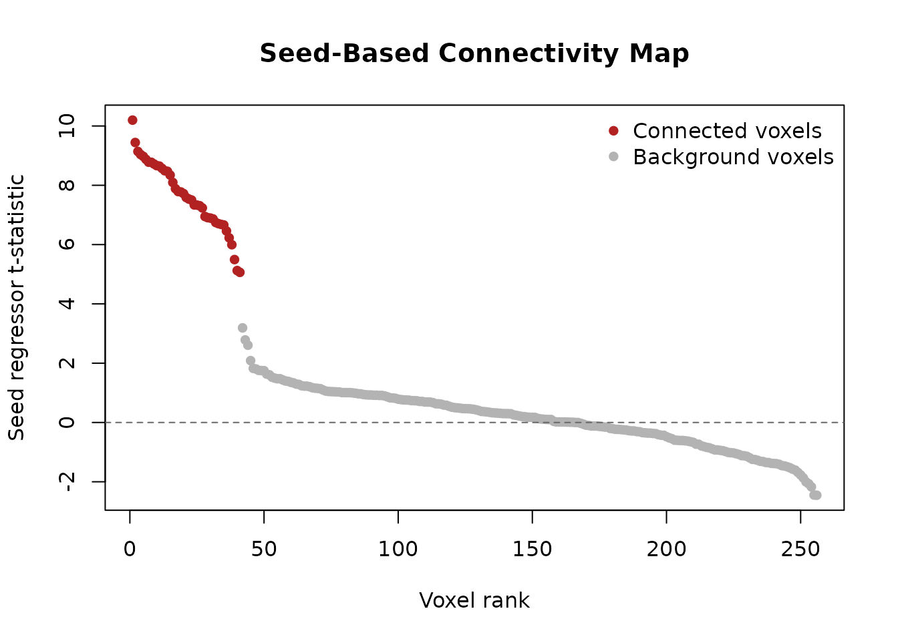

# Functional Connectivity (Seed-Based)

## Overview

Seed-based functional connectivity analysis is a fundamental technique
in fMRI research for identifying brain regions that show correlated
activity with a specific region of interest (the “seed”). This vignette
demonstrates how to perform seed-based connectivity analysis using
fmrireg’s flexible design matrix and GLM framework.

The approach we’ll take treats the seed time series as an experimental
regressor rather than computing simple correlations. This allows us to
control for nuisance variables like scanner drift and motion parameters
while estimating connectivity strength. The resulting t-statistics
provide a connectivity map showing which voxels have activity
significantly related to the seed region after accounting for confounds.

To illustrate the method clearly, we’ll work with simulated data where
we know the ground truth. We’ll create a dataset with a hidden network
of voxels that share a common signal with our seed region, then recover
this network using our connectivity analysis.

## Creating a Test Dataset with Known Connectivity

First, we’ll generate a simulated fMRI dataset where we control which
voxels are functionally connected. This allows us to validate our
analysis method since we know the true connectivity pattern.

``` r

set.seed(42)

# Set up the temporal parameters for our scan
Tlen <- 180  # 180 time points
TR   <- 2    # 2-second repetition time

# Generate baseline fMRI data with realistic noise properties
sim <- simulate_fmri_matrix(
  n = 256,                  # number of voxels
  total_time = Tlen * TR,
  TR = TR,
  n_events = 5,             # events are not used here; we ignore the event_table
  durations = 0,
  noise_type = "ar1",       # autoregressive noise typical of fMRI
  noise_ar = 0.3,
  noise_sd = 1.0,
  random_seed = 123
)

dset <- sim$time_series  
Y    <- get_data_matrix(dset)  # Extract the T x V data matrix
dim(Y)
#> [1] 180 256
```

Now we’ll create our ground truth connectivity pattern. We generate a
seed time series with temporal autocorrelation (mimicking real neural
activity) and inject this signal into a subset of voxels to create a
“network” that’s functionally connected to our seed.

``` r

# Generate a seed signal with realistic temporal properties
seed_ts <- arima.sim(model = list(ar = 0.5), n = Tlen)
seed_ts <- as.numeric(base::scale(seed_ts))

# Define which voxels belong to our network
V    <- ncol(Y)
seed_voxel <- 10  # Our seed is voxel 10
net_idx    <- c(seed_voxel, sample(setdiff(1:V, seed_voxel), 40))  # 41 connected voxels

# Add the seed signal to network voxels (creating functional connectivity)
Y[, net_idx] <- Y[, net_idx] + 0.6 * seed_ts

# Rebuild the dataset from the modified matrix so the injected network signal
# is the data used by downstream model fitting.
dset_modified <- fmridataset::matrix_dataset(
  Y,
  TR = TR,
  run_length = Tlen,
  event_table = data.frame(onset = 0, run = 1)
)
```

## Modeling Scanner Drift

Before we can accurately estimate connectivity, we need to account for
low-frequency scanner drift that can create spurious correlations
between voxels. The fmrireg package provides flexible tools for modeling
these nuisance signals using basis functions.

``` r

# Create a sampling frame for our single run
sframe <- sampling_frame(rep(Tlen, 1), TR = TR)

# Model drift using B-splines
bmodel <- baseline_model(basis = "bs", degree = 3, sframe = sframe)
X_drift <- as.matrix(design_matrix(bmodel))
q <- ncol(X_drift)
```

## Connectivity Analysis Using fmrireg’s GLM Framework

Now comes the key insight of our approach: instead of computing simple
correlations, we’ll treat the seed time series as an experimental
regressor in a GLM. This allows us to estimate connectivity while
simultaneously controlling for confounds. The
[`covariate()`](https://bbuchsbaum.github.io/fmridesign/reference/covariate.html)
function in fmridesign is perfect for this, as it adds regressors
without HRF convolution (since the seed signal is already a BOLD time
series).

``` r

# Set up the event model structure
# We need a minimal event_data frame to define the model structure
event_data <- data.frame(
  onset = samples(sframe)[1],  # Single onset to define the model
  run = 1                       # Single run indicator
)

# The seed time series is provided as covariate data
cov_data <- data.frame(
  seed = seed_ts  # Our seed signal for each time point
)

# Build the event model with seed as a covariate
emodel <- event_model(
  onset ~ covariate(seed, data = cov_data, prefix = "seed"),
  data = event_data,
  block = ~ run,
  sampling_frame = sframe
)

# Reuse our baseline model from above
bmodel <- baseline_model(
  basis = "bs", 
  degree = 3, 
  sframe = sframe
)

# Combine event and baseline models with the dataset
fmodel <- fmri_model(emodel, bmodel, dset_modified)

# Fit the connectivity GLM across all voxels
fit <- fmri_lm(
  fmodel,
  dataset = dset_modified
)
```

With the model fitted, we can now extract the connectivity statistics.
The t-statistic for the seed regressor at each voxel tells us how
strongly that voxel’s activity relates to the seed after accounting for
drift.

``` r

# Extract connectivity statistics using the estimate output itself
all_stats <- as.matrix(stats(fit, type = "estimates"))
seed_cols <- grep("seed", colnames(all_stats), value = TRUE)
if (length(seed_cols) == 0) {
  stop("No seed estimate found in fitted model output")
}
seed_col_name <- seed_cols[1]
t_seed <- as.numeric(all_stats[, seed_col_name])

# Also get p-values for significance testing
all_pvals <- as.matrix(p_values(fit, type = "estimates"))
p_seed <- as.numeric(all_pvals[, seed_col_name])

# Check the distribution of our connectivity map
summary(t_seed)
#>    Min. 1st Qu.  Median    Mean 3rd Qu.    Max. 
#> -2.6023 -0.4003  0.3842  1.2858  1.2451  9.9411
```

## Validating the Results

Since we know which voxels belong to our simulated network, we can check
whether our connectivity analysis successfully recovered them. Voxels in
the network should have much larger t-statistics than background voxels
and should dominate the top-ranked discoveries.

``` r

mean_abs_t_network    <- mean(abs(t_seed[net_idx]), na.rm = TRUE)
mean_abs_t_background <- mean(abs(t_seed[-net_idx]), na.rm = TRUE)
sig_rate_network <- mean(p_seed[net_idx] < 0.05, na.rm = TRUE)
sig_rate_background <- mean(p_seed[-net_idx] < 0.05, na.rm = TRUE)

top_ranked <- order(t_seed, decreasing = TRUE)[seq_along(net_idx)]
top_rank_enrichment <- mean(top_ranked %in% net_idx)

stopifnot(
  is.finite(mean_abs_t_network),
  is.finite(mean_abs_t_background),
  is.finite(sig_rate_network),
  is.finite(sig_rate_background),
  is.finite(top_rank_enrichment),
  mean_abs_t_network > 5 * mean_abs_t_background,
  sig_rate_network > 0.9,
  sig_rate_background < 0.1,
  top_rank_enrichment > 0.9
)

c(
  mean_abs_t_network = mean_abs_t_network,
  mean_abs_t_background = mean_abs_t_background,
  sig_rate_network = sig_rate_network,
  sig_rate_background = sig_rate_background,
  top_rank_enrichment = top_rank_enrichment
)
#>    mean_abs_t_network mean_abs_t_background      sig_rate_network 
#>            7.65896313            0.80911959            1.00000000 
#>   sig_rate_background   top_rank_enrichment 
#>            0.04186047            1.00000000
```

The network voxels dominate the top-ranked statistics and are
significant far more often than background voxels, confirming that the
fitted model recovers the injected connectivity pattern rather than a
diffuse background effect.

## Visualizing the Connectivity Map

A rank-ordered view makes the signal easier to read than a gray
histogram. The connected voxels are highlighted in red, so you can see
where the injected network separates from the background.

``` r

keep <- which(is.finite(t_seed))
ord <- keep[order(t_seed[keep], decreasing = TRUE)]
is_network <- ord %in% net_idx

stopifnot(length(ord) > 0)

plot(
  seq_along(ord),
  t_seed[ord],
  pch = 16,
  col = ifelse(is_network, "firebrick", "gray70"),
  main = "Seed-Based Connectivity Map",
  xlab = "Voxel rank",
  ylab = "Seed regressor t-statistic"
)
abline(h = 0, lty = 2, col = "gray40")
legend(
  "topright",
  legend = c("Connected voxels", "Background voxels"),
  col = c("firebrick", "gray70"),
  pch = 16,
  bty = "n"
)
```



## Extending to Real Data

The approach demonstrated here with simulated data translates directly
to real fMRI analyses. When working with actual data, you would start by
extracting the seed time series from your region of interest, perhaps
averaging across voxels within an anatomically or functionally defined
ROI.

For a more complete analysis, you might include additional nuisance
regressors such as motion parameters, physiological signals, or global
signal regression. The fmrireg framework makes it straightforward to add
these through the `nuisance_list` parameter in
[`baseline_model()`](https://bbuchsbaum.github.io/fmridesign/reference/baseline_model.html).
You might also apply temporal filtering to focus on specific frequency
bands of interest.

For whole-brain connectivity mapping, this voxelwise approach
efficiently identifies all regions showing significant functional
coupling with your seed. Alternatively, you could perform ROI-to-ROI
connectivity by repeating the analysis with multiple seed regions and
assembling the results into a connectivity matrix.

## Summary

This vignette has demonstrated how fmrireg’s flexible GLM framework
extends naturally to functional connectivity analysis. By treating the
seed time series as an experimental regressor rather than computing
simple correlations, we gain the ability to control for confounds and
obtain proper statistical inference. The same design matrix and model
fitting infrastructure used for task-based fMRI analysis seamlessly
handles connectivity studies, highlighting the versatility of the
fmrireg package.
