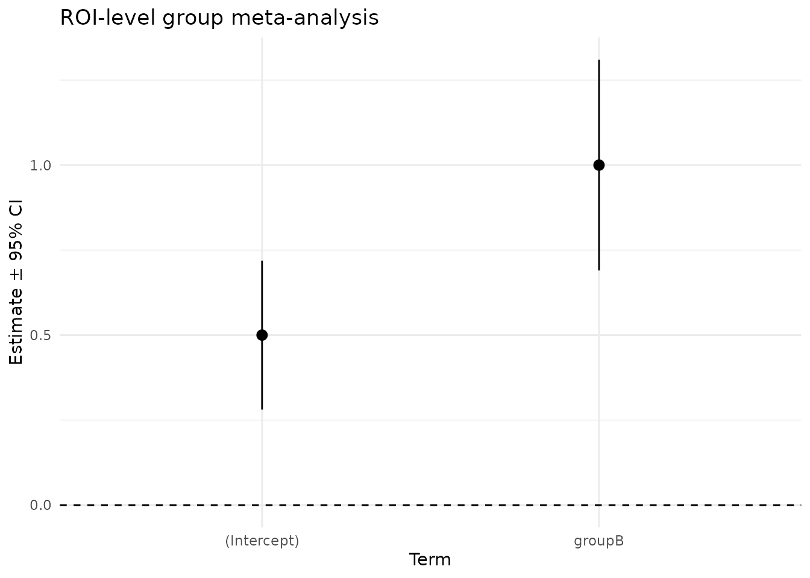

# 

title: “07. Group Analysis” author: “Bradley R. Buchsbaum” date:
“2026-01-28” output: rmarkdown::html_vignette vignette: \> % % % —

``` r
library(fmrireg)
library(ggplot2)
set.seed(123)
```

## Overview

This vignette walks through a compact, end‑to‑end example of group
analysis with fmrireg. We first construct a small ROI‑level dataset to
illustrate the basic meta‑regression interface, and then move to a
voxelwise example using tiny synthetic NIfTI files. Along the way we
show how to compare groups with fixed‑ and random‑effects meta‑analysis,
how to obtain exact contrasts either at fit‑time or post‑hoc by saving
covariance, and how to perform group inference from t‑maps alone using
Stouffer, Fisher, or Lancaster combinations. The same interface scales
to full HDF5/NIfTI workflows created by
[`write_results()`](https://bbuchsbaum.github.io/fmrireg/reference/write_results.md)
and loaded via `group_data(format = "h5"|"nifti")`.

## Create a small ROI dataset

We simulate 10 subjects across two groups (A/B) for a single ROI. Group
B has an effect that is 1 unit larger than group A. All subjects have
the same SE for clarity.

``` r
n_per_group <- 5
subjects <- sprintf("s%02d", 1:(2 * n_per_group))
group <- factor(rep(c("A", "B"), each = n_per_group))

# True effects: A = 0.5, B = 1.5 (difference = 1.0)
beta <- ifelse(group == "A", 0.5, 1.5)
se <- rep(0.25, length(beta))

roi_df <- data.frame(
  subject = subjects,
  roi = "ExampleROI",
  beta = beta,
  se = se,
  group = group,
  stringsAsFactors = FALSE
)

# Build group dataset (CSV/ROI format)
gd <- group_data_from_csv(
  roi_df,
  effect_cols = c(beta = "beta", se = "se"),
  subject_col = "subject",
  roi_col = "roi",
  covariate_cols = c("group")
)

gd
#> Group Data Object
#> Format: csv 
#> Subjects: 10 
#> Covariates: group
```

## Fit group meta-analysis

We first fit an intercept-only model, then a model including a group
term.

``` r
# Intercept-only (grand mean across subjects)
fit_fe <- fmri_meta(gd, formula = ~ 1, method = "fe", verbose = FALSE)

# Intercept + group term (difference-coding for group B relative to A)
fit_cov <- fmri_meta(gd, formula = ~ 1 + group, method = "fe", verbose = FALSE)

print(fit_cov)
#> fMRI Meta-Analysis Results
#> ==========================
#> 
#> Method: fe 
#> Robust: none 
#> Formula: ~1 + group 
#> Subjects: 10 
#> ROIs analyzed: 1 
#> 
#> Heterogeneity:
#>   Mean tau^2: 0 
#>   Mean I^2: NaN %
summary(fit_cov)
#> fMRI Meta-Analysis Summary
#> ==========================
#> 
#> fMRI Meta-Analysis Results
#> ==========================
#> 
#> Method: fe 
#> Robust: none 
#> Formula: ~1 + group 
#> Subjects: 10 
#> ROIs analyzed: 1 
#> 
#> Heterogeneity:
#>   Mean tau^2: 0 
#>   Mean I^2: NaN %
#> 
#> Coefficients:
#>   (Intercept):
#>     Mean effect: 0.5 
#>     Mean SE: 0.1118034 
#>     Significant:1/1 (100%)
#>   groupB:
#>     Mean effect: 1 
#>     Mean SE: 0.1581139 
#>     Significant:1/1 (100%)
```

Note: With equal SE per subject, fixed-effects and random-effects will
yield similar point estimates. Random-effects (`method = "pm"`) will
estimate between- subject heterogeneity (`tau2`) when present.

``` r
fit_pm <- fmri_meta(gd, formula = ~ 1 + group, method = "pm", verbose = FALSE)
summary(fit_pm)
#> fMRI Meta-Analysis Summary
#> ==========================
#> 
#> fMRI Meta-Analysis Results
#> ==========================
#> 
#> Method: pm 
#> Robust: none 
#> Formula: ~1 + group 
#> Subjects: 10 
#> ROIs analyzed: 1 
#> 
#> Heterogeneity:
#>   Mean tau^2: 0 
#>   Mean I^2: NaN %
#> 
#> Coefficients:
#>   (Intercept):
#>     Mean effect: 0.5 
#>     Mean SE: 0.1118034 
#>     Significant:1/1 (100%)
#>   groupB:
#>     Mean effect: 1 
#>     Mean SE: 0.1581139 
#>     Significant:1/1 (100%)
```

## Extract coefficients and a contrast

``` r
coef_names <- colnames(fit_cov$coefficients)
coef_names
#> [1] "(Intercept)" "groupB"

# Intercept should be near 0.5, the group coefficient near 1.0
coef_est <- as.numeric(fit_cov$coefficients[1, ])
names(coef_est) <- coef_names
coef_est
#> (Intercept)      groupB 
#>         0.5         1.0

# Build a simple contrast on the group term (if present)
if (any(grepl("group", coef_names))) {
  # Create a named weight vector that picks out the group coefficient
  w <- rep(0, length(coef_names)); names(w) <- coef_names
  w[grep("group", coef_names)] <- 1
  con <- contrast(fit_cov, w)
  con
}
#> $estimate
#> [1] 1
#> 
#> $se
#> [1] 0.1581139
#> 
#> $z
#> [1] 6.324555
#> 
#> $p
#>                    [,1]
#> ExampleROI 2.539629e-10
#> 
#> $weights
#> (Intercept)      groupB 
#>           0           1 
#> 
#> $name
#> [1] "groupB"
#> 
#> $parent
#> fMRI Meta-Analysis Results
#> ==========================
#> 
#> Method: fe 
#> Robust: none 
#> Formula: ~1 + group 
#> Subjects: 10 
#> ROIs analyzed: 1 
#> 
#> Heterogeneity:
#>   Mean tau^2: 0 
#>   Mean I^2: NaN %
#> 
#> attr(,"class")
#> [1] "fmri_meta_contrast"
```

## A quick visualization

We can visualize the group effects and their 95% CIs for the ROI-level
fit.

``` r
df_tidy <- tidy(fit_cov, conf.int = TRUE)
df_tidy
#> # A tibble: 2 × 10
#>   roi        term     estimate std.error statistic  p.value  tau2    I2 conf.low
#>   <chr>      <chr>       <dbl>     <dbl>     <dbl>    <dbl> <dbl> <dbl>    <dbl>
#> 1 ExampleROI (Interc…      0.5     0.112      4.47 7.74e- 6     0    NA    0.281
#> 2 ExampleROI groupB        1       0.158      6.32 2.54e-10     0    NA    0.690
#> # ℹ 1 more variable: conf.high <dbl>

ggplot(df_tidy, aes(x = term, y = estimate, ymin = conf.low, ymax = conf.high)) +
  geom_pointrange() +
  geom_hline(yintercept = 0, linetype = 2) +
  labs(title = "ROI-level group meta-analysis",
       x = "Term", y = "Estimate ± 95% CI") +
  theme_minimal()
```



## Notes on voxelwise analysis

For voxelwise analysis, construct `group_data` with format `"h5"` or
`"nifti"`:

``` r
# HDF5 (produced via write_results.fmri_lm)
# gd_h5 <- group_data(h5_paths, format = "h5",
#                     subjects = subject_ids,
#                     contrast = "ContrastName",
#                     covariates = data.frame(group = group))

# NIfTI (provide per-subject paths for beta/SE or t)
# gd_nii <- group_data(list(beta = beta_paths, se = se_paths), format = "nifti",
#                      subjects = subject_ids,
#                      mask = "group_mask.nii.gz")

# fit <- fmri_meta(gd_h5, formula = ~ 1 + group, method = "pm")
# fit <- fmri_meta(gd_nii, formula = ~ 1, method = "fe")
```

For multiple comparisons correction that leverages spatial structure,
see
[`spatial_fdr()`](https://bbuchsbaum.github.io/fmrireg/reference/spatial_fdr.md)
and
[`create_3d_blocks()`](https://bbuchsbaum.github.io/fmrireg/reference/create_3d_blocks.md).

### Minimal NIfTI Example (Reproducible)

This chunk creates tiny synthetic NIfTI volumes on disk (in a temp dir)
for a voxelwise demonstration. Group B has a higher effect in a small
cube.

``` r
library(neuroim2)

set.seed(42)
tmpdir <- tempdir()
space <- NeuroSpace(c(8, 8, 8), spacing = c(2, 2, 2))

n_per_group <- 3
ids <- sprintf("sub-%02d", 1:(2 * n_per_group))
grp <- factor(rep(c("A", "B"), each = n_per_group))

# Define a small active cube: x=3:5, y=3:5, z=3:5
active <- array(FALSE, dim = c(8, 8, 8))
active[3:5, 3:5, 3:5] <- TRUE

beta_paths <- character(length(ids))
se_paths   <- character(length(ids))

for (i in seq_along(ids)) {
  b <- array(0, dim = c(8, 8, 8))
  # Baseline effect in active region
  b[active] <- if (grp[i] == "A") 0.5 else 1.5
  # Small random noise per voxel (optional)
  b <- b + array(rnorm(length(b), sd = 0.05), dim = dim(b))
  v_beta <- NeuroVol(b, space)

  # Constant SE per voxel
  s <- array(0.25, dim = c(8, 8, 8))
  v_se <- NeuroVol(s, space)

  beta_paths[i] <- file.path(tmpdir, sprintf("%s_beta.nii.gz", ids[i]))
  se_paths[i]   <- file.path(tmpdir, sprintf("%s_se.nii.gz", ids[i]))
  write_vol(v_beta, beta_paths[i])
  write_vol(v_se,   se_paths[i])
}

# Mask covers all voxels
mask_path <- file.path(tmpdir, "mask.nii.gz")
write_vol(NeuroVol(array(1, dim = c(8, 8, 8)), space), mask_path)

# Build group_data and fit voxelwise meta-analysis
gd_nii <- group_data_from_nifti(
  beta_paths = beta_paths,
  se_paths   = se_paths,
  subjects   = ids,
  covariates = data.frame(group = grp),
  mask       = mask_path
)

fit_nii <- fmri_meta(gd_nii, formula = ~ 1 + group, method = "fe", verbose = FALSE)
fit_nii
#> fMRI Meta-Analysis Results
#> ==========================
#> 
#> Method: fe 
#> Robust: none 
#> Formula: ~1 + group 
#> Subjects: 6 
#> Voxels analyzed: 512 
#> 
#> Heterogeneity:
#>   Mean tau^2: 0 
#>   Mean I^2: 0 %

# Get p-values for the group term and count discoveries (uncorrected)
group_col <- grep("group", colnames(fit_nii$coefficients))
pvals <- 2 * pnorm(-abs(fit_nii$coefficients[, group_col] / fit_nii$se[, group_col]))
sum(pvals < 0.05)
#> [1] 27

# Optionally, apply spatial FDR (group term), using simple blocks
sfr <- spatial_fdr(fit_nii, p = colnames(fit_nii$coefficients)[group_col], group = "blocks")
sum(sfr$reject)
#> [1] 75

# Reconstruct an image for the group effect estimate
img_group_est <- coef_image(fit_nii, colnames(fit_nii$coefficients)[group_col], statistic = "estimate")
range(as.array(img_group_est), na.rm = TRUE)
#> [1] -0.09585902  1.08515382
```

### Exact contrasts and stored covariance

You can request exact contrasts at fit-time or store per-voxel
covariance for exact post-hoc contrasts.

``` r
# Exact post-hoc contrasts by storing packed Var(beta) per voxel
fit_nii_pm <- fmri_meta(
  gd_nii, formula = ~ 1 + group, method = "pm",
  return_cov = "tri", verbose = FALSE
)

# Exact post-hoc contrast on the group term
con <- contrast(fit_nii_pm, c("(Intercept)" = 0, group = 1))
summary(con)
#>          Length Class     Mode     
#> estimate 512    -none-    numeric  
#> se       512    -none-    numeric  
#> z        512    -none-    numeric  
#> p        512    -none-    numeric  
#> weights    2    -none-    numeric  
#> name       1    -none-    character
#> parent    17    fmri_meta list

# Exact fit-time contrast without storing covariance
fit_nii_con <- fmri_meta(
  gd_nii, formula = ~ 1 + group, method = "pm",
  contrasts = matrix(c(0, 1), nrow = 1,
                     dimnames = list("group", colnames(fit_nii_pm$model$X))),
  verbose = FALSE
)
str(fit_nii_con$contrasts)
#> List of 4
#>  $ names   : chr "group"
#>  $ estimate: num [1:512, 1] 2.05e-02 1.79e-02 -3.49e-03 -5.51e-02 3.53e-05 ...
#>  $ se      : num [1:512, 1] 0.204 0.204 0.204 0.204 0.204 ...
#>  $ z       : num [1:512, 1] 0.100565 0.0878 -0.017112 -0.269929 0.000173 ...
```

### Two-sample t-test (Welch and OLS) on NIfTI

As an alternative to meta-analysis, we can run two-sample voxelwise
t-tests directly on the per-subject beta maps, using either Welch’s
unequal-variance test or a standard OLS/Student t-test via a simple
design matrix.

``` r
# Welch and classic OLS via high-level R wrapper
fit_welch <- fmri_ttest(gd_nii, formula = ~ 1 + group, engine = "welch")
t_welch   <- as.numeric(fit_welch$t["group", ])
df_welch  <- as.numeric(fit_welch$df["group", ])
p_welch   <- 2 * pt(abs(t_welch), df = df_welch, lower.tail = FALSE)

fit_ols   <- fmri_ttest(gd_nii, formula = ~ 1 + group, engine = "classic")
# Prefer named row; fallback to 2nd row if rownames are missing
rn_t      <- rownames(fit_ols$t)
if (!is.null(rn_t) && any(rn_t == "group")) {
  t_ols <- fit_ols$t["group", ]
  df_ols <- as.numeric(fit_ols$df["group", ])
} else {
  t_ols <- fit_ols$t[2, ]
  df_ols <- rep(fit_ols$df[2, 1], length(t_ols))
}
p_ols    <- 2 * pt(abs(t_ols), df = df_ols, lower.tail = FALSE)

# Reconstruct quick image for Welch t (using the same mask/space)
timg_welch <- NeuroVol(array(NA_real_, dim = c(8, 8, 8)), space)
mask_img   <- if (!is.null(gd_nii$mask_data)) gd_nii$mask_data else neuroim2::read_vol(mask_path)
timg_welch[as.array(mask_img) > 0] <- t_welch
range(as.array(timg_welch), na.rm = TRUE)
#> [1] -81.539233   4.582865

# Count uncorrected significant voxels at alpha=0.05
sum(p_welch < 0.05)
#> [1] 46
sum(p_ols   < 0.05)
#> [1] 51
```

## Combining t-statistics only (Stouffer/Fisher/Lancaster)

When only per‑subject t‑statistics and degrees‑of‑freedom are available,
you can still carry out group inference without betas/SEs by setting
`combine =` in
[`fmri_meta()`](https://bbuchsbaum.github.io/fmrireg/reference/fmri_meta.md)
(or in `fmri_ttest(..., engine = "meta")`). Stouffer combines signed
z‑scores and supports equal, inverse‑variance or custom weights; Fisher
combines p‑values with equal weights; and Lancaster provides a weighted
Fisher variant by mapping weights to per‑subject degrees‑of‑freedom.

``` r
# Derive per-subject t images from the synthetic beta/SE example
dat_full <- read_nifti_full(gd_nii)
tmat <- dat_full$beta / dat_full$se  # S x P

# Write t images to tempdir for illustration
t_paths <- character(length(ids))
for (i in seq_along(ids)) {
  img <- NeuroVol(array(NA_real_, dim = c(8, 8, 8)), space)
  img[as.array(neuroim2::read_vol(mask_path)) > 0] <- tmat[i, ]
  pth <- file.path(tmpdir, sprintf("%s_t.nii.gz", ids[i]))
  write_vol(img, pth)
  t_paths[i] <- pth
}

gd_t <- group_data_from_nifti(
  t_paths = t_paths,
  df = 60,  # scalar df replicated per subject for demo
  subjects = ids,
  covariates = data.frame(group = grp),
  mask = mask_path
)

# Equal-weight Stouffer
fit_st <- fmri_meta(gd_t, formula = ~ 1, combine = "stouffer", verbose = FALSE)

# Weighted Stouffer using custom subject weights (e.g., sample size)
w_subj <- rep(1, length(ids))
fit_st_w <- fmri_meta(gd_t, formula = ~ 1, combine = "stouffer",
                      weights = "custom", weights_custom = w_subj,
                      verbose = FALSE)

# Fisher (equal weights) and Lancaster (weighted Fisher)
fit_fi  <- fmri_meta(gd_t, formula = ~ 1, combine = "fisher", verbose = FALSE)
fit_la  <- fmri_meta(gd_t, formula = ~ 1, combine = "lancaster",
                     weights = "custom", weights_custom = w_subj,
                     verbose = FALSE)
```

## Meta engine via fmri_ttest with weights

The t-test interface supports the meta engine with equal/custom
weighting.

``` r
fit_tt_meta <- fmri_ttest(gd_nii, formula = ~ 1 + group, engine = "meta",
                          weights = "equal")
```

``` r
# Meta engine with custom subject weights (e.g., sample sizes or reliability)
w_subj <- rep(1, length(ids))
fit_tt_meta_w <- fmri_ttest(gd_nii, formula = ~ 1 + group, engine = "meta",
                            weights = "custom", weights_custom = w_subj)
```

``` r
# t-only combine via fmri_ttest delegation (Lancaster, weighted Fisher)
fit_tt_la <- fmri_ttest(gd_t, formula = ~ 1, engine = "meta",
                        combine = "lancaster", weights = "custom",
                        weights_custom = w_subj)
```

### ROI t-only example (Stouffer and Lancaster)

You can also combine t-statistics at the ROI level from a tabular CSV.
Provide per-subject t and df, then choose a combine method.

``` r
roi_t_df <- data.frame(
  subject = subjects,
  roi = "ExampleROI",
  t = rnorm(length(subjects), mean = 2.0, sd = 0.5),
  df = 40,
  stringsAsFactors = FALSE
)

gd_roi_t <- group_data_from_csv(
  roi_t_df,
  effect_cols = c(t = "t", df = "df"),
  subject_col = "subject",
  roi_col = "roi"
)

# Equal-weight Stouffer on ROI t-statistics
fit_roi_st <- fmri_meta(gd_roi_t, formula = ~ 1, combine = "stouffer", verbose = FALSE)

# Lancaster (weighted Fisher) with custom weights (e.g., per-subject reliability)
w_roi <- rep(1, length(subjects))
fit_roi_la <- fmri_meta(gd_roi_t, formula = ~ 1, combine = "lancaster",
                        weights = "custom", weights_custom = w_roi,
                        verbose = FALSE)

c(fit_roi_st$method, fit_roi_la$method)
#> [1] "pm" "pm"
```

## A brief recap

Meta‑analysis in fmrireg supports fixed‑effects and several
random‑effects estimators (`method = "fe"|"pm"|"dl"|"reml"`), with
optional robust Huber weighting. You can pass subject‑level covariates
for group comparisons and, when working from t‑maps only, set
`combine =` to use Stouffer, Fisher, or Lancaster. Exact contrasts are
available either at fit‑time (via `contrasts=`) or post‑hoc by saving
packed covariance with `return_cov = "tri"` and then calling
[`contrast()`](https://bbuchsbaum.github.io/fmrireg/reference/contrast.md).
Weighting applies to both meta‑regression and t‑only combinations
(`weights = "ivw"|"equal"|"custom"`, with `weights_custom` as a vector
of length subjects or an S×P matrix). The examples above show ROI‑based
meta‑regression, voxelwise fits from NIfTI, and t‑only combinations via
both
[`fmri_meta()`](https://bbuchsbaum.github.io/fmrireg/reference/fmri_meta.md)
and `fmri_ttest(..., engine = "meta")`.
